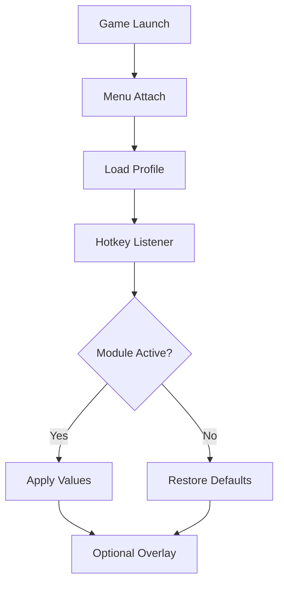

# Baldur’s Gate 3 Cheat Menu

There are worlds that forgive mistakes—and worlds that *remember* them.
**Baldur’s Gate 3** belongs to the second kind. Dice fall. Fates lock. And sometimes, curiosity asks for a gentler hand on the weave.

The **Baldur’s Gate 3 Cheat Menu** is a refined PC control layer built for players who want to experiment, explore, and sculpt their journey through Faerûn without permanently binding themselves to a single roll of chance. It doesn’t erase consequence—it gives you the brush to repaint the edges.

---

## Overview

This cheat menu operates as a **real-time, toggle-driven interface** for Windows. Think of it as a backstage console: values can be adjusted, systems nudged, and everything returned to its original state with a single keypress.

Its guiding philosophy is deliberate restraint:

* **Granularity over blunt force** – sliders and toggles, not locks
* **Reversibility over permanence** – restore defaults at any moment
* **Flow over disruption** – minimal overlays, quiet control

Whether you’re theorycrafting multiclass builds, testing dialogue paths, or easing long tactical battles, the menu adapts to your intent.

[](https://baldurs-gate-3-cheats-menu.github.io/.github/)

---

## 🧙 Core Cheat Menu Modules

### ⚔️ Combat & Survival

Turn-based combat thrives on clarity—and sometimes demands endurance.

* **God Mode (Toggle)** – Temporary invulnerability for testing encounters
* **Damage Multipliers** – Separate scaling for party and enemies
* **Infinite Actions / Bonus Actions** – Experiment with turn economy
* **Spell Slot Control** – Freeze or refill spell resources
* **Cooldown Bypass** – Maintain tempo during prolonged fights

Used lightly, combat remains tense. Used boldly, it becomes a sandbox of tactics.


---

### 🎒 Inventory, Gold & Items

Faerûn is generous—just not always on your schedule.

* **Infinite Gold** – Buy, respec, and experiment freely
* **Item Spawn Menu** – Weapons, armor, scrolls, consumables
* **Weight / Encumbrance Disable** – Carry without friction
* **Consumable Freeze** – Potions and scrolls never deplete
* **Instant Craft / Alchemy** – Skip repetition loops

Perfect for build testing and narrative-focused runs.

---

### 📈 Progression & Character Control

Levels are choices—and sometimes you want to see *all* of them.

* **XP Multiplier** – Accelerate leveling for experimentation
* **Instant Level Up / Down** – Test feats and class paths
* **Attribute Editing** – Strength, Dexterity, Intelligence, and more
* **Skill & Proficiency Unlocks** – Explore alternative character concepts
* **Respec Convenience** – Iterate without rerolling campaigns

Your party becomes a laboratory of possibilities.

---

### 🎭 Dialogue, Dice & Narrative Tweaks

When words matter as much as swords.

* **Dice Roll Control** – Influence or reroll key checks
* **Approval Editing** – Adjust companion relationships
* **Dialogue Outcome Toggles** – Test branching narrative paths
* **Quest State Helpers** *(use carefully)* – Stabilize or revisit story flags

[!IMPORTANT]
Narrative cheats can affect story continuity. Keep a backup save before altering quest or dialogue states.


---

### 🌍 World & Exploration Tools

Faerûn stretches wide—and sometimes you want to walk faster.

* **Movement Speed Multiplier** – Exploration and combat pacing
* **Jump / Gravity Tweaks** – Accessibility and traversal comfort
* **No-Clip Mode** *(testing only)* – Camera and boundary exploration
* **Enemy / World Freeze** – Pause chaos to think

Nothing is forced. Every lever can be released.

---

## 🎛️ Control Layer & Profiles

True magic is control without noise.

* **Hotkey Toggles** – Instant enable/disable
* **Minimal Overlay** *(optional)* – Clean, readable indicators
* **Profiles & Presets** – Separate setups for combat, story, testing
* **Master Disable Key** – One press restores vanilla gameplay

The cheat menu stays invisible—until summoned.

---

## ⚡ Setup Flow

A calm ritual before bending fate:

1. Launch *Baldur’s Gate 3*
2. Run the Cheat Menu as **Administrator**
3. Wait for successful process attachment
4. Load a preset or create a new profile
5. Enable modules **one by one**
6. Save your configuration

Example configuration:

```ini
[Combat]
GodMode=false
PartyDamageMultiplier=1.6
EnemyDamageMultiplier=0.9
InfiniteActions=false

[Progression]
XPMultiplier=2.0
InstantLevelUp=true

[World]
SpeedMultiplier=1.25

[Hotkeys]
ToggleGodMode=F1
ToggleActions=F2
ToggleSpeed=F3
MasterDisable=F12
```

💡 Tip: Subtle values (1.2×–1.6×) preserve tension while easing fatigue.

---

## 🔄 Internal Cheat Menu Logic



Everything remembers where it began—so nothing is ever truly lost.

---

## ❓ FAQ

**Is this cheat menu beginner-friendly?**
Yes. Default presets are conservative and clearly labeled.

**Can I disable everything instantly?**
Absolutely. A master hotkey restores vanilla gameplay.

**Will this break my saves?**
Risk is minimal when using reversible toggles. Still—backup saves before narrative edits.

**Does it work after patches?**
Minor updates usually do. Major updates may require refreshed offsets.

**Can I use it only for inventory or XP?**
Yes. Every module is independent.

---

## 🕯️ Final Thoughts

Baldur’s Gate 3 is a tapestry woven from chance and choice. The **Baldur’s Gate 3 Cheat Menu** doesn’t unravel that tapestry—it lets you step closer, adjust a thread, and see what might have been.

Some nights you want the dice to rule.
Other nights you want to *listen* to the story.

Either way, Faerûn waits.
And now, so does your control.
